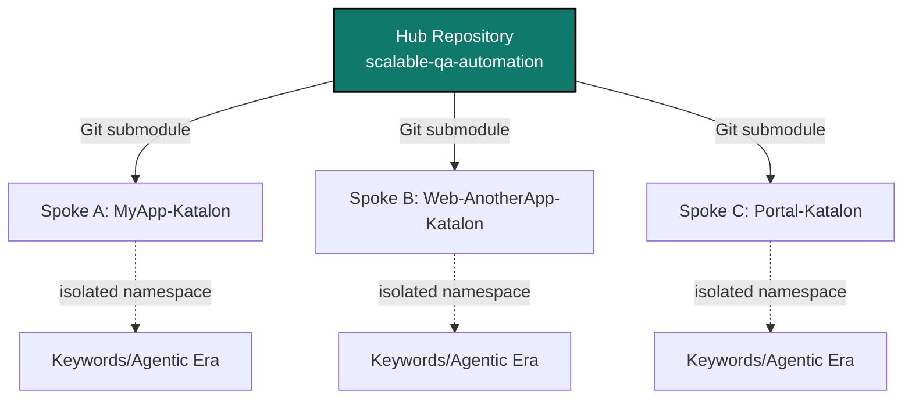

# Hub-and-Spoke Automation Architecture

## Problem

In a large digital ecosystem, dozens of application teams independently build test automation. Without central governance, each team reinvents keywords, conventions, and execution profiles — leading to inconsistent quality standards and duplicated effort.

## Solution

A central **Hub** repository owns the shared automation backbone:

- Shared Keywords
- Test Listeners
- Execution profiles and naming conventions
- CI/CD pipeline templates
- Agentic AI helpers

Each application repository is a **Spoke** that consumes the Hub via Git submodules and places all shared content under a dedicated namespace to avoid collisions with local assets.

## Why namespace isolation matters

A typical Spoke repo already has its own Keywords and Test Listeners. By symlinking Hub content only into an isolated sub-directory, local and shared assets coexist without merge conflicts or path collisions.

## Distribution model

## Outcome

- One source of truth for conventions.
- 31+ heterogeneous apps share the same automation backbone.
- New apps onboard via a single adoption script.
